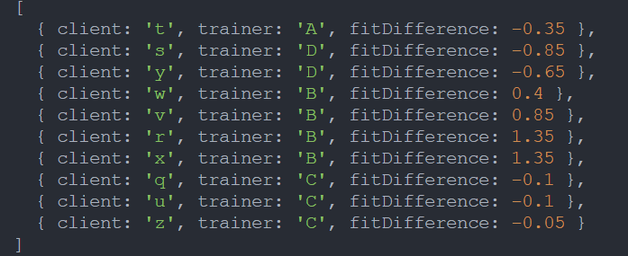
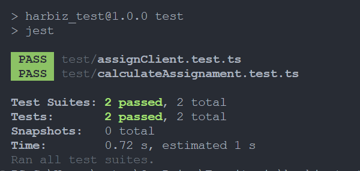

# Harbiz Test Project
## Asignación de entrenadores a clientes según su reputación

El siguiente test forma parte de la prueba técnica para la posición de **Full-Stack Junior Developer** para **Harbiz**.  
Consiste en asignar entrenadores a cada cliente teniendo en cuenta la reputación de cada entrenador en relación con las exigencias de cada cliente. 
De esta forma, cada cliente tendrá asignado un entrenador que se adapte en la mayor medida y de forma óptima a sus expectativas.

### Índice:
- Descripción
- Instalación
- Uso
- Tecnologías
- Comentarios y documentación utilizada
- Posibles mejoras

## Descripción:
El proyecto utiliza TypeScript para manejar toda la lógica. He decidido   estructurar el código en módulos para otorgarlo de mayor orden y facilitar el mantenimiento.

### A destacar:
- Asignación de clientes a entrenadores tratando de utilizar un código lo más limpio posible, facilitando su legibilidad y orden.
- Implementación modular import/export.
- Se han implementado test con Jest para mejorar la seguiridad y solidez del proyecto.

## Instalación:
- Node.js 
- npm
- TypeScript
- Jest

### Instrucciones:
1. Clonar repositorio: 
[*link*](https://github.com/IsaacOrtga/harbiz_test.git)
2. Entrar en el directorio: 
*cd harbiz_test*
3. Instalar las dependencias: 
*npm install*
4. Compilar proyecto: 
*tsc*

## Uso:
1. Si no se ha compilado el proyecto, compilarlo:
**tsc**
2. Dirigirse a la carpeta build:
**cd build**
3. Ejecutar node:
**node index.js**
4. Observar el resultado en la consola.

### Resultado:

## Tecnologías:
El proyecto se desarrolló con las siguientes tecnologías:
- TypeScript
- Node.js
- Jest
- npm

## Comentarios y documentación utilizada: 
La mayor dificultad a la hora de enfrentar la tarea, fue la de cómo abordar el cálculo de las expectativas/exigencias del cliente con la reputación del entrenador.  
Tuve que mirar varias formas de cálculo matemático para abordar este tipo de problemas, tales como la media ponderada:
[*Wikipedia: media ponderada*](https://es.wikipedia.org/wiki/Media_ponderada)

Sin embargo, finalmente me decidí por hacer el cálculo a través de una *medida de distancia* a través de la diferencia absoluta. Es decir, la diferencia entre dos números.  
Lo cuál me pareció más sencillo para abordar el problema, fácil de entender y de traducir a código.
[Faster Capital: diferencia absoluta](https://fastercapital.com/es/contenido/Diferencia-absoluta--una-mirada-mas-cercana-a-la-funcion-de-valor-absoluto.html#:~:text=En%20matem%C3%A1ticas%2C%20la%20diferencia%20absoluta,absoluta%20entre%20ellos%20es%2013.)

Con respecto al código, la propia función para ordenar y asignar fue la que más tiempo me llevó. No obstante, creo que se consiguió cierta limpieza y optimización. 
 

También decidí utilizar el loop de for...of porque me parece más moderno y limpio frente a otras opciones que, aunque serían igual de útiles, exigen más líneas de código: [Geeksforgeeks: Bucle for...of](https://www.geeksforgeeks.org/iterate-over-characters-of-a-string-in-typescript/#using-forof-loop)

En el siguiente bloque de código que se muestra, una de las dificultades con las que me encontré, que fue la de evitar errores en TypeScript al asignarle al principio el valor de null a bestTrainer.  
A pesar de que es un error que no impide que el código se ejecute sin problemas, buscando la mayor limpieza, finalmente decidí añadir un condicional antes de utilizar la variable señalada.

### Testing:

Se han hecho test de las dos funciones que se encuentran en assignments.ts:

- calculateAssignament();
    - Se ha comprobado que da un resultado correcto y que no sea NaN
- assignClient();
    - Se ha comprobado que se asignan correctamente 
    - Se ha comprobado que a los trainers, una vez ordenados, se le restan los cupos correspondientes

## Posibles mejoras:

- Renderizar los resultados a través del DOM para visualizarlos en el navegador
- Darle estilos con CSS3
- Utilizar alguna herramienta como Bootstrap o MaterialUI
- Posible refactorización y mejora, incluso mayor encapsulación del código
- Despliegue en servicios de deploying gratuitos como Netlify

Estas mejoras se podrían hacer, pero se ha decidido no llevarlas a cabo para poder entregar el test lo antes posible.
No obstante, soy consciente de que, sobre todo poder representarlo y darle estilos con HTML5 y CSS3, podría mejorar mucho la experiencia, incluyendo un despliegue para poder verla con simplemente visitar una url.